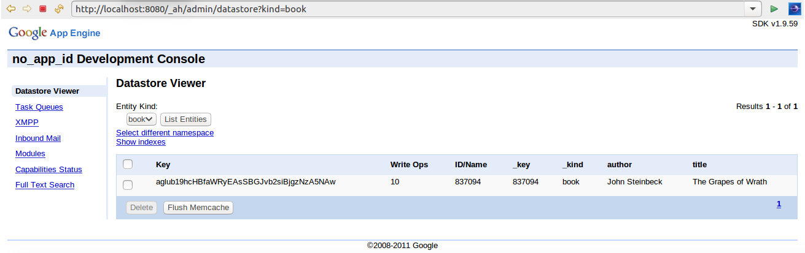
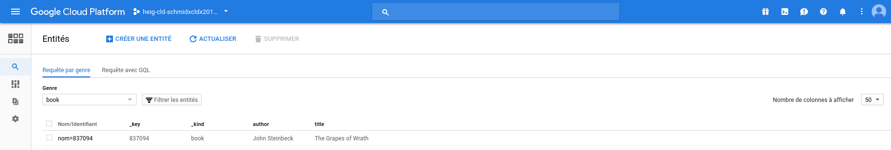
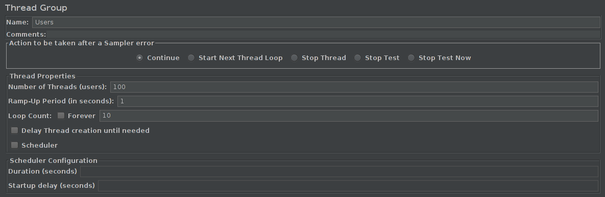
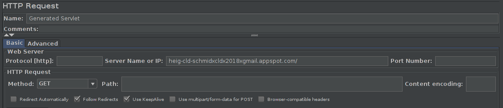
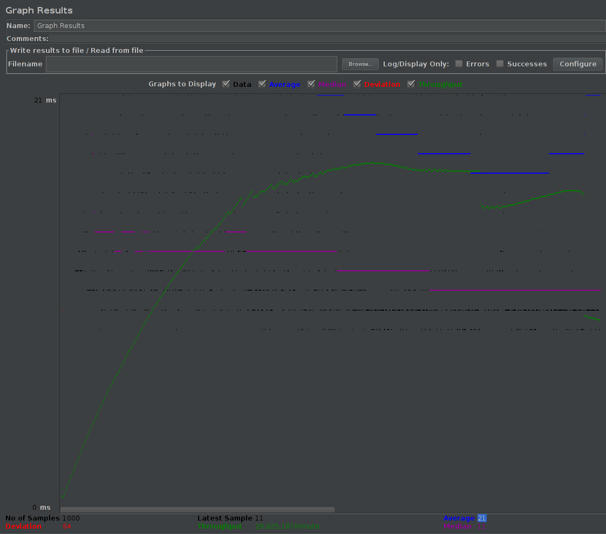
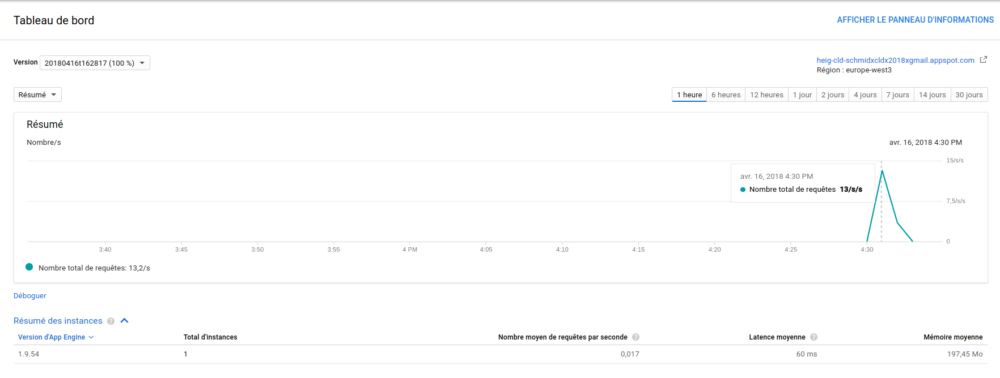
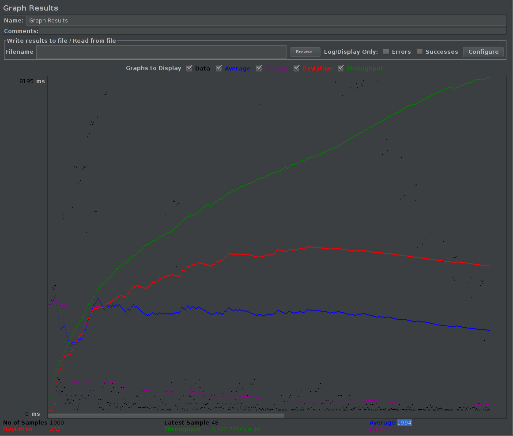
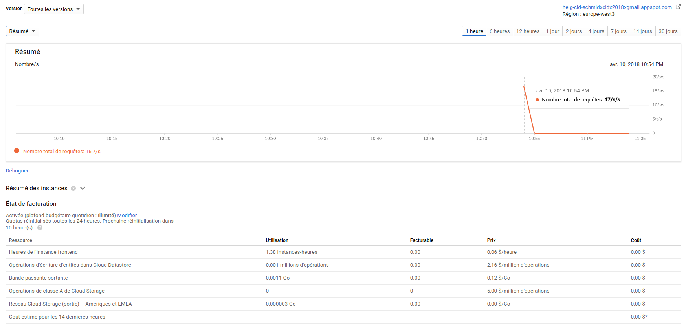
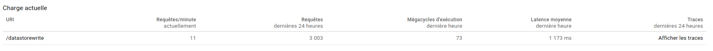
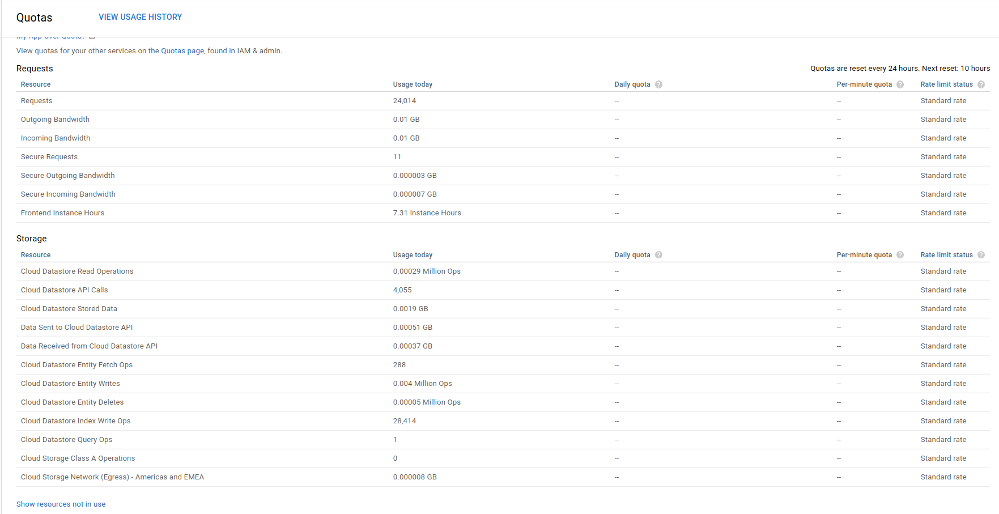

# LAB 03: GOOGLE APP ENGINE
## Authors
 * Emmanuel Schmid
 * Wojciech Myszkorowski

## TASK 1 DEPLOYMENT OF A SIMPLE WEB APPLICATION

### What does the code HelloAppEngine.java ?
The file **HelloAppEngine.java** is a servlet which override the doGET method.
When someone access to the specific url **localhost:8080/hello**, the request is handle by the servlet which return a message.
The response is formated using **utf-8** and contain a plain text **Hello App Engine**.

### What does web.xml do ?
The mappings are needed by the web application server to route the incoming HTTP requests to the right Servlets.
In the servlet **HelloAppEngine.java**, the mapping between the route **/hello** and the servlet is done by an anotation **@WebServlet**.
Another way to map servlets with routes is to use the deployment descriptor **web.xml**. It normally contains information such as version, servlets mapping, encoding, etc.

### What information does appengine-web.xml contain?
An app Engine Java application uses the deployement description **web.xml** and the **appengine-web.xml**. This configuration file specify for exemple an application ID and an version identifier.

## TASK 2: DEVELOP A SERVLET THAT USES THE DATASTORE

### Copy the Servlet into the report
```java
package heigvd.ch;

import java.io.IOException;
import java.io.PrintWriter;
import java.util.Date;
import java.util.Enumeration;

import javax.servlet.ServletException;
import javax.servlet.annotation.WebServlet;
import javax.servlet.http.HttpServlet;
import javax.servlet.http.HttpServletRequest;
import javax.servlet.http.HttpServletResponse;

import com.google.appengine.api.datastore.DatastoreService;
import com.google.appengine.api.datastore.DatastoreServiceFactory;
import com.google.appengine.api.datastore.Entity;

@WebServlet(
	    name = "DatastoreWrite",
	    urlPatterns = {"/datastorewrite"}
	)
@SuppressWarnings("serial")
public class DatastoreWriteSimple extends HttpServlet {

    @Override
    protected void doGet(HttpServletRequest request, HttpServletResponse response)
                         throws ServletException, IOException {
		
    	 DatastoreService datastore = DatastoreServiceFactory.getDatastoreService();
    	 
        response.setContentType("text/plain");
        response.setCharacterEncoding("UTF-8");
        
        PrintWriter pw = response.getWriter();
        
        String kind = request.getParameter("_kind");
        String key = request.getParameter("_key");
        Entity book; //= null;
        Enumeration<String> parametersNames = request.getParameterNames();
        
        if(kind == null) {
        	 pw.println("Parameter _kind is missing !");
        	 return;
        } else if (key == null) {
        	book = new Entity(kind);
        } else {
        	book = new Entity(kind,key);
        }
                
        String currentParameterName;
        String currentParameterValue;
        while(parametersNames.hasMoreElements()) {
        	currentParameterName = parametersNames.nextElement();
        	
        	if(!currentParameterName.equals("_kind") || !currentParameterName.equals("_key")) {
            	currentParameterValue = request.getParameter(currentParameterName);
            	book.setProperty(currentParameterName, currentParameterValue);
        	}
               	
        }
		pw.println("Writing entity to datastore.");
		datastore.put(book);
    }
}
```

### Copy a screenshot of the local and the App Engine console with the Datastore Viewer
#### Local console
```
2018-04-04 22:18:06.221:INFO::main: Logging initialized @765ms
2018-04-04 22:18:06.726:INFO:oejs.Server:main: jetty-9.3.18.v20170406
2018-04-04 22:18:10.361:INFO:oeja.AnnotationConfiguration:main: Scanning elapsed time=3386ms
2018-04-04 22:18:11.122:INFO:oejsh.ContextHandler:main: Started c.g.a.t.d.j.DevAppEngineWebAppContext@3ad83a66{/,file:///home/labuser/eclipse-workspace/.metadata/.plugins/org.eclipse.wst.server.core/tmp0/lab3/,AVAILABLE}{/home/labuser/eclipse-workspace/.metadata/.plugins/org.eclipse.wst.server.core/tmp0/lab3}
2018-04-04 22:18:11.130:INFO:oejs.AbstractConnector:main: Started NetworkTrafficSelectChannelConnector@72c8e7b{HTTP/1.1,[http/1.1]}{localhost:8080}
2018-04-04 22:18:11.135:INFO:oejs.Server:main: Started @5681ms
Apr 04, 2018 8:18:11 PM com.google.appengine.tools.development.jetty9.JettyContainerService startHotDeployScanner
INFO: Full scan of the web app in place every 1s.
Apr 04, 2018 8:18:11 PM com.google.appengine.tools.development.AbstractModule startup
INFO: Module instance default is running at http://localhost:8080/
Apr 04, 2018 8:18:11 PM com.google.appengine.tools.development.AbstractModule startup
INFO: The admin console is running at http://localhost:8080/_ah/admin
Apr 04, 2018 10:18:11 PM com.google.appengine.tools.development.DevAppServerImpl doStart
INFO: Dev App Server is now running
Apr 04, 2018 10:18:55 PM com.google.appengine.api.datastore.dev.LocalDatastoreService init
INFO: Local Datastore initialized: 
	Type: High Replication
	Storage: /home/labuser/eclipse-workspace/.metadata/.plugins/org.eclipse.wst.server.core/tmp0/lab3/WEB-INF/appengine-generated/local_db.bin
Apr 04, 2018 10:18:55 PM com.google.appengine.api.datastore.dev.LocalDatastoreService load
INFO: Time to load datastore: 47 ms
```

#### Local Datastore Viewer



#### App Engine console
```
Reading application configuration data...


Beginning interaction for module default...
0% Scanning for jsp files.
2018-04-04 22:02:04.607:INFO::main: Logging initialized @282ms
2018-04-04 22:02:04.862:INFO:oejs.Server:main: jetty-9.3.18.v20170406
2018-04-04 22:02:06.382:INFO:oeja.AnnotationConfiguration:main: Scanning elapsed time=1092ms
2018-04-04 22:02:06.455:INFO:oejq.QuickStartDescriptorGenerator:main: Quickstart generating
2018-04-04 22:02:06.526:INFO:oejsh.ContextHandler:main: Started o.e.j.q.QuickStartWebApp@5f2050f6{/,file:///home/labuser/eclipse-workspace/.metadata/.plugins/com.google.cloud.tools.eclipse.appengine.deploy/tmp/1522872122639/staging/,AVAILABLE}
2018-04-04 22:02:06.551:INFO:oejs.Server:main: Started @2228ms
2018-04-04 22:02:06.565:INFO:oejsh.ContextHandler:main: Stopped o.e.j.q.QuickStartWebApp@5f2050f6{/,file:///home/labuser/eclipse-workspace/.metadata/.plugins/com.google.cloud.tools.eclipse.appengine.deploy/tmp/1522872122639/staging/,UNAVAILABLE}
Success.
Temporary staging for module default directory left in /home/labuser/eclipse-workspace/.metadata/.plugins/com.google.cloud.tools.eclipse.appengine.deploy/tmp/1522872122639/staging
Services to deploy:

descriptor:      [/home/labuser/eclipse-workspace/.metadata/.plugins/com.google.cloud.tools.eclipse.appengine.deploy/tmp/1522872122639/staging/app.yaml]
source:          [/home/labuser/eclipse-workspace/.metadata/.plugins/com.google.cloud.tools.eclipse.appengine.deploy/tmp/1522872122639/staging]
target project:  [heig-cld-schmidxcldx2018xgmail]
target service:  [default]
target version:  [20180404t220210]
target url:      [https://heig-cld-schmidxcldx2018xgmail.appspot.com]


Beginning deployment of service [default]...
Some files were skipped. Pass `--verbosity=info` to see which ones.
You may also view the gcloud log file, found at
[/home/labuser/.config/gcloud/logs/2018.04.04/22.02.08.304622.log].
#============================================================#
#= Uploading 11 files to Google Cloud Storage               =#
#=============================================================================================================================================================File upload done.
Updating service [default]...
..............done.
Updating service [default]...
.Waiting for operation [apps/heig-cld-schmidxcldx2018xgmail/operations/b28edf79-7dbb-4d79-85a6-4c6287d66ab6] to complete...
.............done.
.done.
Deployed service [default] to [https://heig-cld-schmidxcldx2018xgmail.appspot.com]

You can stream logs from the command line by running:
  $ gcloud app logs tail -s default

To view your application in the web browser run:
  $ gcloud app browse --project=heig-cld-schmidxcldx2018xgmail

```

#### App Engine Datastore Viewer




## TASK 3: TEST THE PERFORMANCE OF DATASTORE WRITES

### Test configuration
100 users who request 10 times servlet
#### Thread Groups

#### HTTP Request (Generated Servlet)

#### HTTP Request (Datastore Servlet)


### Generated Servlet
#### JMeter Graph Results listener

#### App Engine Dashboard view

#### What response times do you observe in the test tool and App Engine console ?
| Tool | average response times (ms) |
|---|---|
| App-Engine  | 60 |
| Jmeter  |  21 |

### Datastore Servlet
#### JMeter Graph Results listener

#### App Engine Dashboard view


#### What response times do you observe in the test tool and App Engine console ?
| Tool | average response times (ms) |
|---|---|
| App-Engine  |  1173 |
| Jmeter  | 1994 |


### Compare the response times shown by the test tool and the App Engine console. Explain the difference.
The response time average available trough the App Engine Dashboard and Jmeter do not match. The difference can be explained by 2 mains reasons:
1. The period over which the response time average is calculated isn't the same in the App Engine Dashboard and Jmeter. Every Jmeter is run independently and it calculate the average ony for the exectued test. While the value available on the console of the App Engine is calculated on all the dataset available (regroups several tests).
2. Measures are not collected in the same way. Jmeter calculate the responses time when it actualy receive the response. App Engine can not use the same approcahe beacuse it doesn't know when the response reach the client.

### How much resources have you used running these tests?
From the Quota Details view of the console determine the non-zero resource quotas (Daily quota different from 0%). Explain each with a sentence. To get a sense of everything that is measured click on Show 
resources not in use.



We didn't find any informations about the quotas ! So we juste have described which resources we used and a short description.

#### Request
|  Ressource | Description  |
|---|---|
| Request | Number of request send to the app  |
| Outgoing Bandwidth | Traffic coming out of the application (reponses)  |
| Incoming Bandwidth | Incoming traffic from the application (requests)  |
| Frontend Instance Hours | Time (in hours) of frontend activity |

#### Storage
|  Ressource | Description  |
|---|---|
| Cloud Datastore Read Operations | The total number of Datastore read operations  |
| Cloud Datastore API Calls | Number of time that the API has been called  |
| Cloud Datastore Stored Data | Amount of data which is stored in the datastore   |
| Data Sent to Cloud Datastore API | Amout of data which has been sent to API  |
| Data Received from Cloud Datastore API | Amout of data which has been receive from API|
| Cloud Datastore Entity Fetch Ops| Number of entities who have been recover  |
| Cloud Datastore Entity Writes | Number of entity write to datastore |
| Cloud Datastore Entity Deletes | Number of entity's deletation |
| Cloud Datastore Index Write Ops | Number of index who has been write to datastore  |


### Let's suppose you become suspicious that the algorithm for the automatic scaling of instances is not working correctly. Imagine a way in which the algorithm could be broken. Which measures shown in the console would you use to detect this failure?
1. Limit of the number of instances
2. Daily quota limit: Check the status of the different quotas in the "Quotas" menu
4. Services de la platform Google Cloud indisponible : View the status of services at: https://status.cloud.google.com

